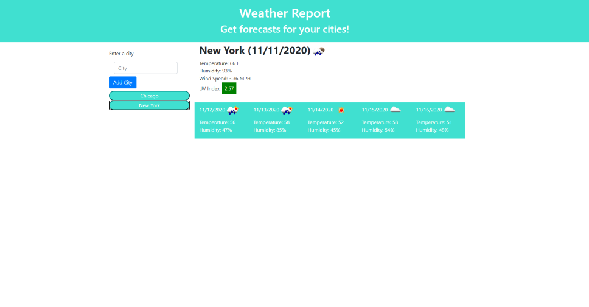

# Weather-Report

This project is a weather forecast site that incorporates the OpenWeather API to give real time weather forecasts. This site is designed for travelers who want to see weather forecasts for multiple cities so they can plan their trip accordingly.

## Features

### Weather Dashboard w/ Form Inputs
The weather dashboard form input allows you to enter and add cities to your dashboard. Added cities will appear as buttons that, when clicked, will display the weather forecast for that city. You can clear all your cities at any time using the clear button.

### Weather Display
When a city button is clicked, the weather for that city will be displayed to the right. The display contains the following data: city name and day, icon displaying weather conditions, current temperature, humidity, wind speed, and the UV index. The UV index will range from green to red, green being safe and red being severe.

### 5-Day Forecast
In addition to displaying the current weather, the city's 5-day forecast will be included underneath the main display. Each day will include the calendar date, predicted temperature, and predicted humidity.

### Local Storage
Whenever you add a city to your dashboard, it will be saved to local storage along with the rest of your cities. Whenever you reload the page, all your saved cities will be displayed along with the weather forcast of the last city you viewed.

## Credits
https://getbootstrap.com/
 
https://code.jquery.com/
 
https://momentjs.com/
 
https://openweathermap.org/

## Link
https://tchristensendrumz.github.io/Weather-HW/
